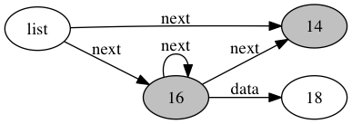

# Travioli

Travioli is a dynamic analysis to identify program functions that traverse input data-structures, and aid in understanding what context such functions are invoked in. 

Currently, only JavaScript programs are supported. Travioli uses [Jalangi2](https://github.com/Samsung/jalangi2) for instrumenting JavaScript programs to generate read-write events for every load/store of a JavaScript variable, object field or array element. Travioli then analyzes the generated trace to detect data-structure traversals in the presence of loops or recursion.

## Requirements

Travioli supports ECMAScript 5 and has been tested on NodeJS v4.4.0. You will need to have **node** and **npm** installed.

Travioli uses **python** for the back-end analysis. We *strongly* recommend using the [pypy](http://pypy.org) implementation. Travioli's analysis is CPU-intensive; pypy's tracing JIT compiler speeds up analysis over the default CPython runtime by anywhere from 4x to 10x, and saves a lot of memory too. 

Travioli's run script looks for a binary named `pypy` in the current `PATH` and if not found falls back to the `python` command.

**[Optional]** If you wish to use Travioli for visualization, you will need **GraphViz** to render access graphs from the `dot` files that Travioli generates. This software is available as `graphviz` via `brew` and `apt-get`/`aptitude`.

## Installation

1. Clone this Git repository on your machine. We will call this directory `PATH_TO_TRAVIOLI`.
2. Do `cd <PATH_TO_TRAVIOLI>` and `npm install jalangi2` to install Jalangi in the Travioli directory.
3. (Optional) Install `progressbar2` via PIP. If you are using `pypy`, this can be done via `pypy -m install progressba2r`. For standard python, this is `pip install progressbar2`. This step can be skipped if you are a patient person who does not need to know how much progress Travioli's analysis has made while it is running.

## Usage

Assume you have a JavaScript program which you normally run with NodeJS as follows:
```
$ node <my_program> [my_program_args...]
```

To run this program with Travioli, do:
```
$ <PATH_TO_TRAVIOLI>/bin/run.sh <my_program> [my_program_args...]
```

This will first execute the program normally, then with instrumentation, and then analyze the generated trace with Travioli. All intermediate files are stored in a directory `.travioli` created in whatever parent directory the above command was run in.

## Results

`cd .travioli` to go to the results directory.

The main file to look at is `traversals.out`. This file lists all data-structures whose traversals were identified, and all their associated traversal points. For example, running travioli on the file [`lists.js`](test/lists.js) gives:

```
+ Data structure: (lists.js[27:1-35:2]).node
(1) Traversal point [25] upto 5 times
    - lists.js[30:13-30:22]
    # Analyzed Function: lists.js[27:1-35:2]
    # Access Graph: ag_1:537
    # Reached from the following AECs: 26
    # Last written at the following AECs: 5
(2) Traversal point [35] upto 5 times
    - lists.js[33:19-33:28]
    # Analyzed Function: lists.js[27:1-35:2]
    # Access Graph: ag_1:537
    # Reached from the following AECs: 36
    # Last written at the following AECs: 5
+ Data structure: <global>.list
(1) Traversal point [14] upto 5 times
    - lists.js[21:9-21:18]
    # Analyzed Function: lists.js[19:1-25:2]
    # Access Graph: ag_1:377
    # Reached from the following AECs: 15
    # Last written at the following AECs: 5
```

Data-structures are named by access paths starting from a global variable `<global>.{var}[.{field}]+` or from a local variable `{function}.{var}.[.{field}]+`, where `{var}` is a variable name, `{field}` is a field name or array index, and `{function}` is the source location where the function is declared (we use source locations rather than function names, because the latter are not unique and do not even exist for anonymous functions). In the above example, `<global>.list` refers to the global variable `list`, while `(lists.js[27:1-35:2]).node` refers to the local variable `node` in the function declared in `lists.js` from line 27 column 1 to line 35 column 2. 

### Acyclic Execution Contexts

An *acyclic execution context* (AEC) is just like a stack-trace, in that it displays a point in program execution as a list: the first item is a program-location and the rest are function invocation-locations in reverse order (most recent call first). 
The term *acyclic* implies that AECs never contain the same function more than once, and thus there are never any cycles. For executions that involve recursive functions, Travioli reduces the stack-trace by removing cycles such that the resulting acyclic execution context is also a valid stack-trace (see the research paper for more details). Travioli uses AECs to represent recursive data-structure traversals in a concise manner.

AECs either start with some base function or can be extended all the way to the top-level call. If Travioli detects a function that performs data-structure traversal, it will report the AECs of traversal points with respect to the traversing function in the `traversals.out` file itself. If you are interested in seeing the full AECs from the outermost call (usually in the top-level script scope), these AECs are listed as *read* and *write* contexts. 

In the above example, traversal point `[35]` has the expansion `lists.js[33:19-33:28]`, corresponding to the expression [`node.next` on line 33](test/lists.js#L33). AECs for read/write contexts are listed as just numeric identifiers to avoid cluttering this file. If you want to expand a numeric AEC identifier, then from the `.travioli` directory do:

```
$ <PATH_TO_TRAVIOLI>/bin/aec <AEC_IDENTIFIER>
```

For the above example:
```
$ <PATH_TO_TRAVIOLI>/bin/aec 36
<PATH_TO_TRAVIOLI>/test/lists.js[33:19-33:28]
<PATH_TO_TRAVIOLI>/test/lists.js[38:9-38:27]
<PATH_TO_TRAVIOLI>/test/lists.js[87:1-87:8]
```

This tells as that the read context AEC 36 starts with the invocation of at line 87 (in this case, of [`case3()` on line 87](test/lists.js#L87) and is followed by the invocation of [`contains()` on line 38](test/lists.js#L38) and then the expression [`node.next` on line 33](test/lists.js#L33)).

The write context is also a full AEC but corresponds to the program-locations where the data-structure fields being traversed were written.

### Access Graphs Visualization

This directory also contains all the generated access graphs with extension `dot`. You will need `GraphViz` installed to render the access graphs into a format like PDF or PNG.

The traversal points listed in `traversals.out` list the function in which they are analyzed and the name of the access graph file. For example, the last traversal above is in the file `ag_1:377.dot`. A convenience script is provided to convert this into PNG. From the `.travioli` directory do:
```
$ <PATH_TO_TRAVIOLI>/bin/dot.sh 1:377
``` 

The command renders the access graph in the files `ag_1:377.png` and `ag_1:377.pdf`. Open one of these files in your system's image or PDF viewer to see the access graph, which should help visualize the traversal of the linked-list:



The root variable is `list`, the edges are labeled with field-names, and the nodes are labeled with AEC identifiers (see above for how to expand the AEC). Nodes are colored grey if they correspond to traversal points, and colored black if they correspond to redundant traversal points.

If you wish to render all access graphs at once, simply omit the argument to `dot.sh` as follows:
```
$ <PATH_TO_TRAVIOLI>/bin/dot.sh
``` 

Note that rendering can be quite time-consuming for large applications. This command will generate a bunch of PNG and PDF files corresponding to access graphs of all functions that Travioli has analyzed. A convenience script is provided to help match the function-location identifiers in the access graph filenames (or in `traversals.out`) to positions in the source file. For example, to determine what function the access graph `ag_1:377` corresponds to, run:


```
$ <PATH_TO_TRAVIOLI>/bin/loc 1 377
<PATH_TO_TRAVIOLI>/test/lists.js[19:1-25:2]
``` 

The output indicates that the function is located in [`lists.js` at lines 19-25](test/lists.js#L19-L25).


